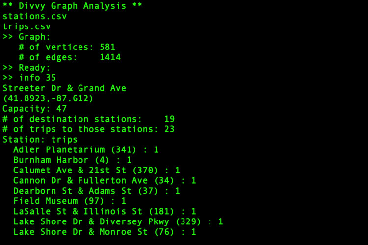
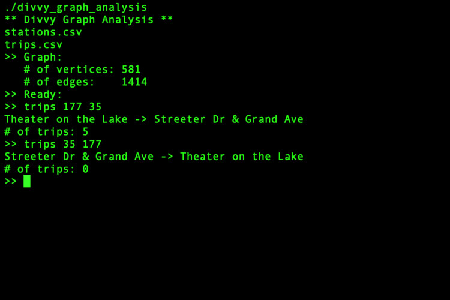
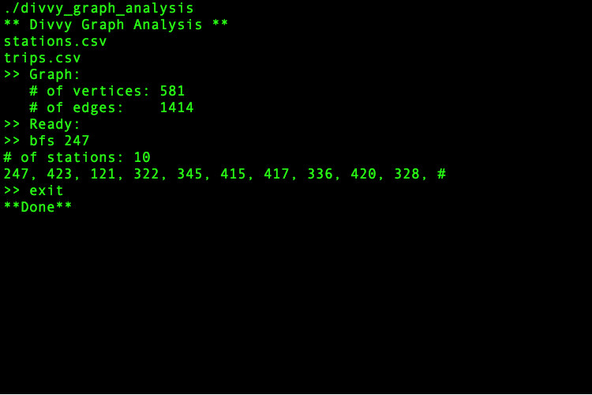

# divvy-graph-analysis
Analysis Divvy Bike Data Using Graphs

This project is based on [Divvy AVL project](https://github.com/alexviznytsya/divvy-avl-analysis). Program uses a graph to analyze trips between stations. User inputs Divvy station and trip data, program builds a graph of the # of trips between stations, and then interact with the user to support the following 5 commands:

1. Info about a station.
2. Number of trips between 2 stations.
3. Breadth-First Search (BFS) from a station.
4. Debug.
5. Exit

The data will come from 2 input files, both in CSV format (Comma-Separated Values). This program is written in C++.

## User Commands:

1. info **_station_id_** - provides info about a station (Picture above). The user inputs a station id, and the program outputs the following information:
    -   Name
    -   Position
    -   Capacity
    -   Number of adjacent stations in the graph
    -   Total # of trips to those adjacent stations
    -   A list of each adjacent station (name and id) with
    -   Number of trips to that station

2. trips **_station_id1_** **_station_id2_** - given the starting station id and the destination station id, reports the # of trips taken from the starting station to the destination station.

3. bfs **_station_id1_** - performs a breadth-first search, starting from the given station id. The output is just station ids and those are in order.

4. debug - imply calls the PrintGraph function in the graph class. This is one way to see if you have built the graph correctly.

5. exit - when user wishes to stop.

## CSV Stations file stucture:

| id | name | latitude | longitude | dpcapacity | online_date |
|---------|:---------:|:-------:|:-------:|:-------:|:-------:|
| 456 | 2112 W Peterson Ave | 41.991178 | -87.683593 | 15 | 5/12/2015 |
| 101 | 63rd St Beach | 41.78101637 | -87.57611976 | 23 | 4/20/2015 |
| ...     | ...       | ...     |...     |...     |...     |...     |

## CSV Trips file stucture:

| trip_id | starttime | stoptime | bikeid | tripduration | from_station_id | from_station_name | to_station_id | to_station_name | usertype | gender | birthyear |
|---------|:---------:|:-------:|:-------:|:-------:|:-------:|:-------:|:-------:|:-------:|:-------:|:-------:|:-------:|
| 10426648 | 6/30/2016 23:57 | 7/1/2016 0:22 | 4050 | 1466 | 259 | California Ave & ... | 123 | California Ave & ... | Subscriber | Female | 1986 |
| 10426638 | 6/30/2016 23:55 | 7/1/2016 0:40 | 4579 | 2713 | 177 | Theater on the Lake | 340 | Clark St & Wrightwood Ave| Customer | ...| ... |
| ...     | ...       | ...     |...     |...     |...     |...     |...     |...     |...     |...     |...     |

